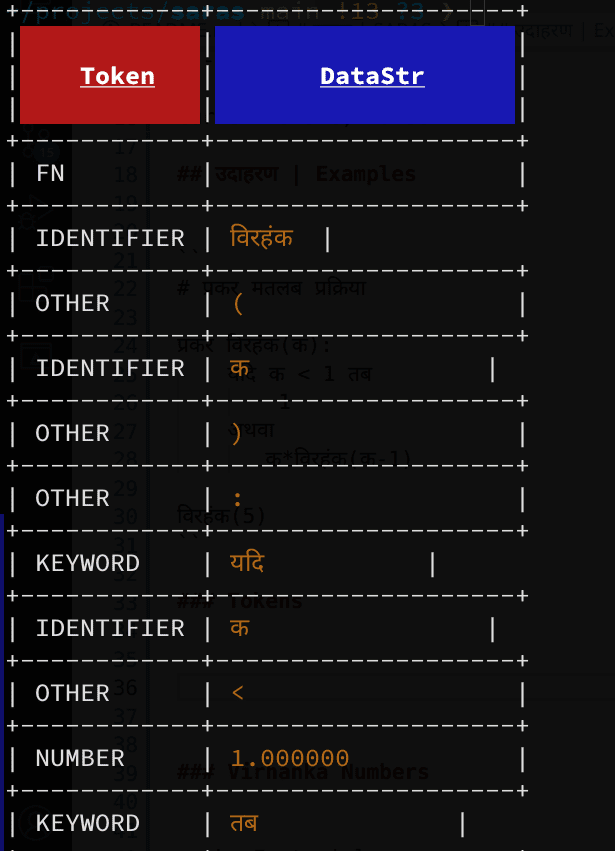
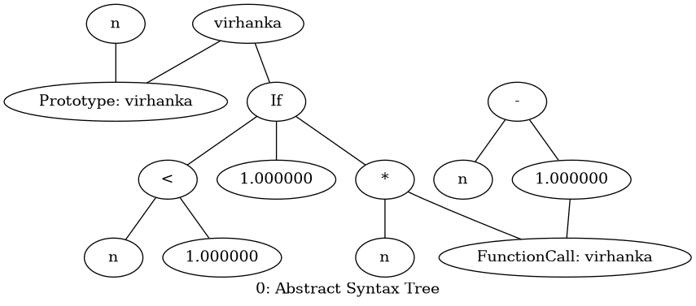

# सारस | SARAS
### Started with following [LLVM's tutorial](https://www.llvm.org/docs/tutorial/MyFirstLanguageFrontend/)

> Note: This was tested with `llvm-libs-17.0.5`

In development, a hobby project only

> JIT is broken right now, 'jit' branch par code hai uska
> Compiler work kar raha hai

To actually try, or see usage with sample programs, see go to
[Practical Usage section](#practical-usage) after building :)

Meaning of the name 'saras':

S -> Sai

A -> Abhay

R -> Rabin

A -> Aditya Gupta

S -> Salman

### Building

First install `cmake` (to build C++ project) & `llvm` (IR to machine code)

```sh
cmake -B build
cmake --build build
```

### Install

```sh
cmake --install build
```

### Use

```
./build/saras --help
Usage: SARAS [options] 

Optional arguments:
-h --help       shows help message and exits
-v --version    prints version information and exits
-l --lexer      Stop at Lexer, only print Tokens read [default: false]
-p --parser     Stop at Parser stage, saves Abstract Syntax Tree in graph*.png files [default: false]
-ir             Stop at IR stage, prints LLVM Intermediate Representation for all expressions and functions [default: false]
--interactive   DEFAULT, provides an interactive console to type [default: true]
```


## उदाहरण | Examples


```
# प्रकर मतलब प्रक्रिया

प्रकर विरहंक(क)
    यदि क < 1 तब
        1
    अथवा
       क*विरहंक(क-1)

विरहंक(5)
```

### Tokens



### Virhanka Numbers


> aka Factorials

```
# virhanka.saras

fn virhanka(n)
    if n < 1 then
        1
    else
        n*virhanka(n-1)

virhanka(5)
```

> Generated with graphviz, code in visualizer.hpp



Generated LLVM IR:

> Generated with `llvm-as < t.ll | opt -analyze  --enable-new-pm=0 -view-cfg`


# Practical Usage

This language is very limited currently, and doesn't include support for linking
with the C Runtime to be able to actually run standalone program, ie. basically
it does not support writing a 'main' function, or a start entry.

So, as of now `saras` can be used to write small functions, and then be used as
a library to use with a C/C++/Rust program etc., which should define the
entrypoint.

Look for files inside the `programs/` directory to look for examples.

Currently we have a caller code in C, which will call the virhanka (aka.
factorial) function defined in 'saras' language syntax.
Currently it has saras files such as 'virhanka.saras', 'विरहंक.सारस' etc..

An example set of commands to run these programs:

```
# First compile saras code to object code
./build/saras -c programs/विरहंक.सारस

# Then compile and link our saras code with caller code written in C
g++ programs/caller_code_hindi.cpp विरहंक.o

# Finally run the program
./a.out
```

### Todo

* https://stackoverflow.com/questions/35526075/llvm-how-to-implement-print-function-in-my-language
* JIT (chap 4)
* Optimisation (chap 4)

> Happy Diwali
