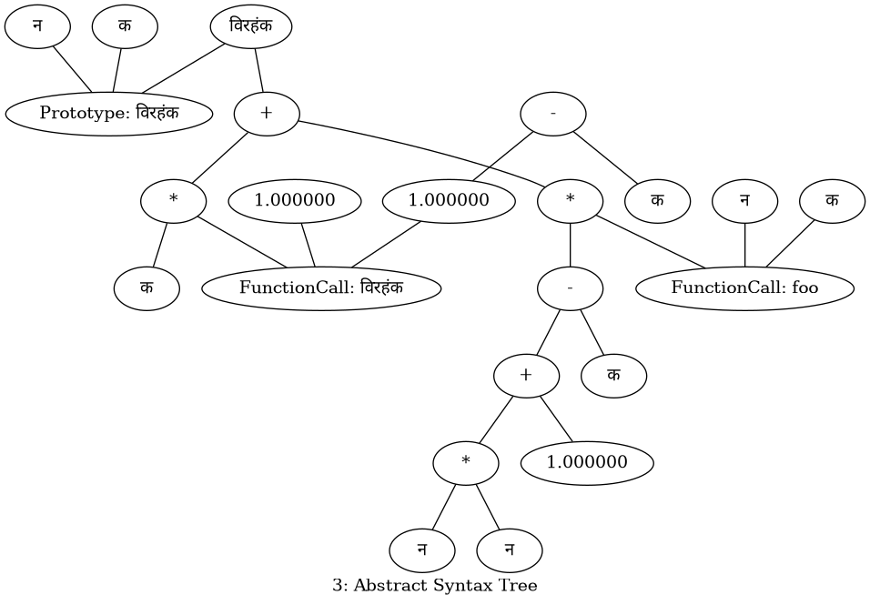

# SARAS
### Following [LLVM's tutorial](https://www.llvm.org/docs/tutorial/MyFirstLanguageFrontend/) for the same

In development, a hobby project only

S -> Sai

A -> Abhay

R -> Rabin

A -> Aditya Gupta

S -> Salman

Currently parser state:

# Todo

* https://stackoverflow.com/questions/35526075/llvm-how-to-implement-print-function-in-my-language
* JIT (chap 4)
* Optimisation (chap 4)

> Happy Diwali
