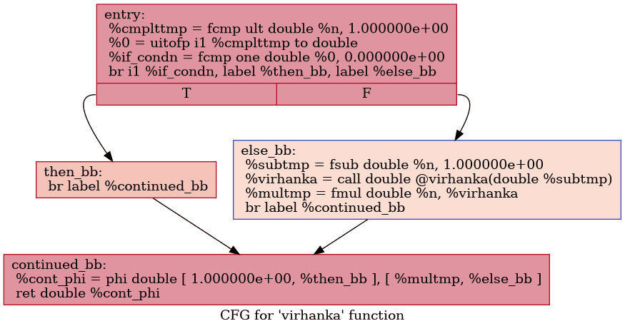

# सारस | SARAS
### Started with following [LLVM's tutorial](https://www.llvm.org/docs/tutorial/MyFirstLanguageFrontend/)

In development, a hobby project only

S -> Sai

A -> Abhay

R -> Rabin

A -> Aditya Gupta

S -> Salman


```
./build/saras --help
Usage: SARAS [options] 

Optional arguments:
-h --help       shows help message and exits
-v --version    prints version information and exits
-l --lexer      Stop at Lexer, only print Tokens read [default: false]
-p --parser     Stop at Parser stage, saves Abstract Syntax Tree in graph*.png files [default: false]
-ir             Stop at IR stage, prints LLVM Intermediate Representation for all expressions and functions [default: false]
--interactive   DEFAULT, provides an interactive console to type [default: true]
```


## उदाहरण | Examples


```
# प्रकर मतलब प्रक्रिया

प्रकर विरहंक(क):
    यदि क < 1 तब
        1
    अथवा
       क*विरहंक(क-1)

विरहंक(5)
```

### Tokens


### Virhanka Numbers


> aka Factorials

```
# virhanka.saras

fn virhanka(n)
    if n < 1 then
        1
    else
        n*virhanka(n-1)

virhanka(5)
```

> Generated with graphviz, code in visualizer.hpp


Generated LLVM IR:

> Generated with `llvm-as < t.ll | opt -analyze  --enable-new-pm=0 -view-cfg`



### Todo

* https://stackoverflow.com/questions/35526075/llvm-how-to-implement-print-function-in-my-language
* JIT (chap 4)
* Optimisation (chap 4)

> Happy Diwali
