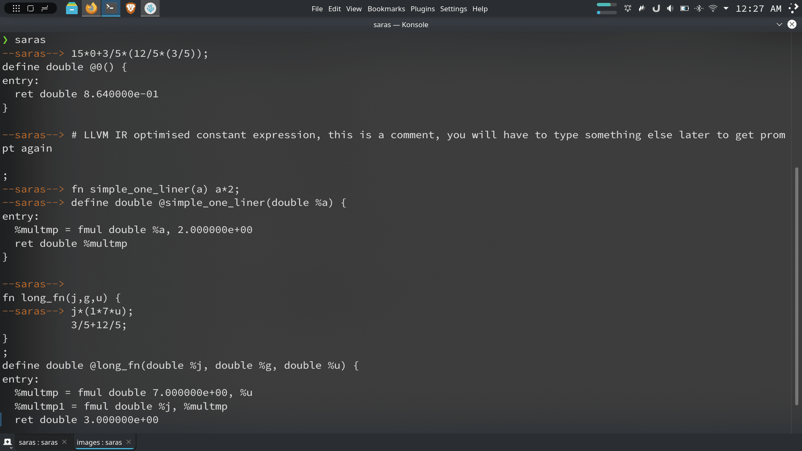
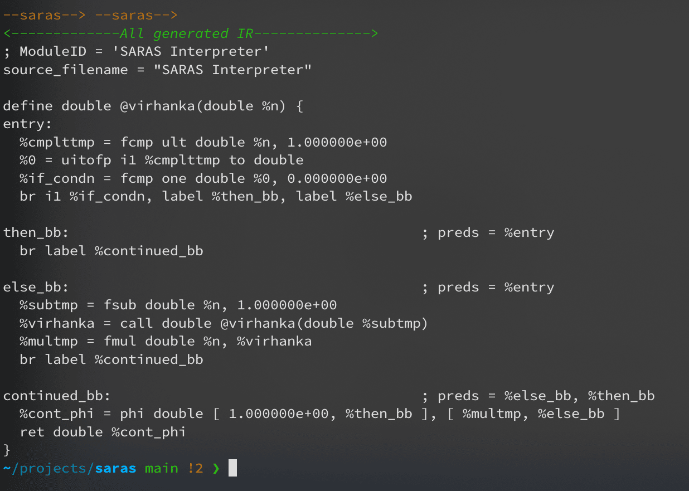

# SARAS example programs

Considering you have installed the compiler (if not, just replace 'saras' with path to 'saras' executable or 'saras.exe')

## Using as interpreter (default mode)

Just type

```sh
saras
```

You will get a console, like in Python, type your code there, it will create AST graphs, print IR code, and probably compile to a file too

Example Output:

> **NOTE**: This doesn't show all capabilities, it can do more, for eg. if else etc.



## Actually Using it

Compiling library written in saras, for example, [programs/virhanka.saras](virhanka.saras) is a library/program containing code for virhanka numbers (aka factorial numbers):

```sh
saras -c programs/virhanka.saras
```

This outputs a 'virhanka.o' object file, now this can be used in ANY C and C++ and almost ALL other languages that support C like programs.


For example,

```sh
g++ virhanka.o programs/caller_code.cpp
```

> [caller_code.cpp](caller_code.cpp) only contains small code to call printf (NOTE: SARAS supports all this too, you can use extern declaration and convert the string to a list of doubles and pass to print, so it's basically easier to do I/O in C++)

Run:

```sh
./a.out
```

**Output**:

```
Virhanka of 6: 720
```

# See parts in action (no gcc required)

## Lexer

```sh
saras -l < programs/विरहंक.सारस
```

**Output**:


## Parser

```sh
saras -p < programs/विरहंक.सारस
```

This saves graph*.png files for each expression, for eg.

**Output**:


## IR

```sh
saras --ir < programs/virhanka.saras
```

This shows the LLVM Intermediate Representation (IR) code for any code you entered

**Output**:



> Same visualised with graphviz:


